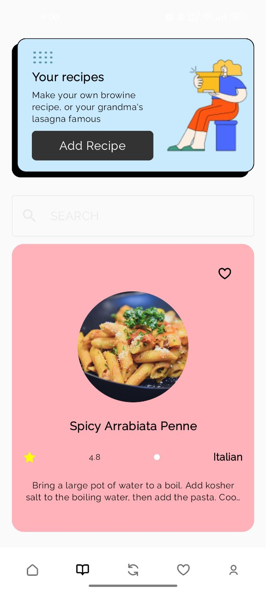

# Snophy Recipes App

Personal project developed with the Android SDK.

All recipe information is provided by [TheMealDB API.](https://www.themealdb.com/api.php) 

## Screenshots
|  |  |
|----------|:-------------:|

|  |  |
|----------|:-------------:|

|  |  |
|----------|:-------------:|
|  |  |
|----------|:-------------:|

|  |  |
|----------|:-------------:|

## Features
- List of recipe categories
- Search recipes from the network
- Infinite scroll with pagination
- Save your favorite recipes in a local database
- Share recipes
- Visit original recipe website within a webview

## Android Development
- Jetpack Compose
- Android KTX
- Kotlin Coroutines
- Flow State
- ViewModel
- Navigation
- Room
- Retrofit
- Hilt
- Coil
- DataStore
- Firebase

